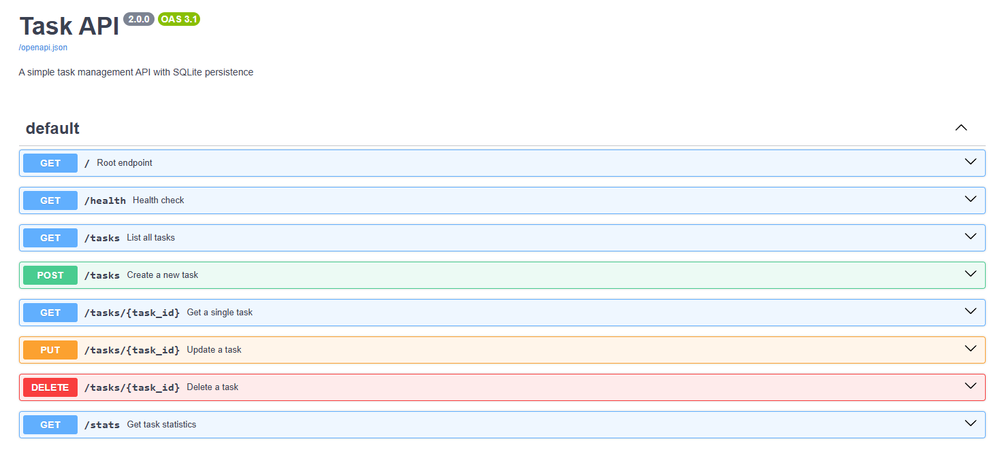
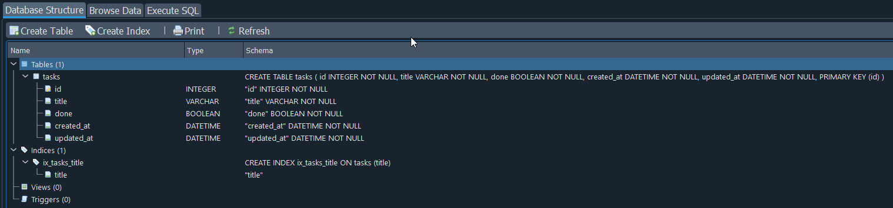

# Tasks - FastAPI CRUD API with SQLite

A simple task management API built with FastAPI demonstrating full CRUD operations with **SQLite persistence** using SQLModel. Includes automatic Swagger UI documentation at `/docs`.

## Features

- **GET /** - API metadata and available endpoints
- **GET /health** - Health check endpoint
- **GET /tasks** - List all tasks (supports `?search=`, `?done=`, `?sort=`)
- **GET /tasks/{id}** - Get a single task by ID (404 if not found)
- **POST /tasks** - Create a new task (validates title, returns 201)
- **PUT /tasks/{id}** - Update task title and/or done status (404 if not found)
- **DELETE /tasks/{id}** - Delete a task (204 No Content, 404 if not found)
- **GET /stats** - Get task statistics (total, completed, pending)

All data stored in **SQLite database** (`tasks.db`) - survives server restarts!

## Quick Start

```bash
# Clone and enter directory
git clone https://github.com/ZakZap16/CRUD-API
cd Assignment1

# Create virtual environment and install dependencies
python -m venv venv
venv\Scripts\activate
pip install -r requirements.txt

# Run the server
python main.py
```

Server starts at **http://localhost:8000**  
Swagger UI available at **http://localhost:8000/docs**

On first run, the database `tasks.db` is automatically created with 3 seed tasks.

## Endpoints

| Method | Endpoint      | Description            | Status Codes  |
| ------ | ------------- | ---------------------- | ------------- |
| GET    | `/`           | API info               | 200           |
| GET    | `/health`     | Health check           | 200           |
| GET    | `/tasks`      | List all tasks         | 200           |
| GET    | `/tasks`      | Search: `?search=term` | 200           |
| GET    | `/tasks`      | Filter: `?done=true`   | 200           |
| GET    | `/tasks`      | Sort: `?sort=title`    | 200           |
| GET    | `/tasks/{id}` | Get task by ID         | 200, 404      |
| POST   | `/tasks`      | Create task            | 201, 422      |
| PUT    | `/tasks/{id}` | Update task            | 200, 404, 422 |
| DELETE | `/tasks/{id}` | Delete task            | 204, 404      |
| GET    | `/stats`      | Get statistics         | 200           |

## Query Parameters for GET /tasks

| Parameter | Values             | Description                               |
| --------- | ------------------ | ----------------------------------------- |
| `search`  | string             | Partial match on title (case-insensitive) |
| `done`    | `true` / `false`   | Filter by completion status               |
| `sort`    | `title` / `-title` | Sort alphabetically (asc/desc)            |

Examples:

- `/tasks?search=API` → tasks containing "API" in title
- `/tasks?done=true` → only completed tasks
- `/tasks?sort=-title` → sort by title descending

## Example Usage

### Create a task

```bash
curl -i -X POST http://localhost:8000/tasks \
  -H "Content-Type: application/json" \
  -d '{"title":"Buy milk"}'
```

**Response:**

```
HTTP/1.1 201 Created
content-type: application/json
content-length: 38

{"id":4,"title":"Buy milk","done":false,"created_at":"...","updated_at":"..."}
```

### List all tasks

```bash
curl -i http://localhost:8000/tasks
```

**Response:**

```
HTTP/1.1 200 OK
content-type: application/json
content-length: ...

[{"id":1,"title":"Learn FastAPI","done":false,"created_at":"...","updated_at":"..."},{"id":2,"title":"Build a REST API","done":false,"created_at":"...","updated_at":"..."},{"id":3,"title":"Deploy to production","done":true,"created_at":"...","updated_at":"..."}]
```

### Get a single task

```bash
curl -i http://localhost:8000/tasks/1
```

**Response:**

```
HTTP/1.1 200 OK
content-type: application/json
content-length: ...

{"id":1,"title":"Learn FastAPI","done":false,"created_at":"...","updated_at":"..."}
```

### Update a task

```bash
curl -i -X PUT http://localhost:8000/tasks/1 \
  -H "Content-Type: application/json" \
  -d '{"done":true}'
```

**Response:**

```
HTTP/1.1 200 OK
content-type: application/json
content-length: ...

{"id":1,"title":"Learn FastAPI","done":true,"created_at":"...","updated_at":"..."}
```

### Delete a task

```bash
curl -i -X DELETE http://localhost:8000/tasks/1
```

**Response:**

```
HTTP/1.1 204 No Content
```

### Get statistics

```bash
curl -i http://localhost:8000/stats
```

**Response:**

```
HTTP/1.1 200 OK
content-type: application/json
content-length: ...

{"total":4,"completed":2,"pending":2}
```

### Validation error (empty title)

```bash
curl -i -X POST http://localhost:8000/tasks \
  -H "Content-Type: application/json" \
  -d '{"title":""}'
```

**Response:**

```
HTTP/1.1 422 Unprocessable Entity
content-type: application/json
content-length: ...

{"detail":[{"type":"string_too_short","loc":["body","title"],"msg":"String should have at least 1 character","input":"","ctx":{"min_length":1}}]}
```

### Not found error

```bash
curl -i http://localhost:8000/tasks/999
```

**Response:**

```
HTTP/1.1 404 Not Found
content-type: application/json
content-length: 30

{"detail":"Task 999 not found"}
```

## Swagger UI

Interactive API documentation available at **http://localhost:8000/docs**



## Database

### Why SQLite?

- **Zero configuration** - no separate server process needed
- **Single file** - entire database in `tasks.db`, easy to backup/move
- **Cross-platform** - works on Windows, macOS, Linux
- **SQL standard** - supports standard SQL queries
- **Lightweight** - perfect for small to medium applications
- **No dependencies** - included in Python standard library (via SQLModel)

### Database Location

The database file is stored at: **`./tasks.db`** (project root directory)

### Schema

```sql
CREATE TABLE tasks (
    id INTEGER PRIMARY KEY AUTOINCREMENT,
    title TEXT NOT NULL,
    done BOOLEAN NOT NULL DEFAULT 0,
    created_at TIMESTAMP NOT NULL DEFAULT CURRENT_TIMESTAMP,
    updated_at TIMESTAMP NOT NULL DEFAULT CURRENT_TIMESTAMP
);
```

### Automatic Initialization

On first run, the application:

1. Creates the `tasks` table if it doesn't exist
2. Inserts 3 seed tasks only if the table is empty:
   - "Learn FastAPI" (pending)
   - "Build a REST API" (pending)
   - "Deploy to production" (completed)

### Database Viewer Screenshot

Open `tasks.db` with **DB Browser for SQLite** to explore the data visually.



### Example SQL Queries

Run these manually in DB Browser for SQLite or any SQLite client:

**List every task:**

```sql
SELECT * FROM tasks;
```

**Show only completed tasks:**

```sql
SELECT * FROM tasks WHERE done = 1;
```

**Count all tasks:**

```sql
SELECT COUNT(*) FROM tasks;
```

**Mark every task as completed:**

```sql
UPDATE tasks SET done = 1;
```

**Delete all completed tasks:**

```sql
DELETE FROM tasks WHERE done = 1;
```

**Search tasks by title (like the API's `?search=`):**

```sql
SELECT * FROM tasks WHERE title LIKE '%API%';
```

**Get statistics (like the API's `/stats`):**

```sql
SELECT
    COUNT(*) as total,
    SUM(CASE WHEN done = 1 THEN 1 ELSE 0 END) as completed,
    SUM(CASE WHEN done = 0 THEN 1 ELSE 0 END) as pending
FROM tasks;
```

Notice how the API immediately reflects your manual database changes!

## Project Structure

```
Assignment1/
├── main.py           # FastAPI application with SQLModel
├── requirements.txt  # Python dependencies
├── README.md         # This file
├── tasks.db          # SQLite database (auto-created)
├── SwaggerUI.png     # Swagger UI screenshot
└── database-viewer.png  # Database viewer screenshot (add yours)
```

## Requirements

- Python 3.10+
- fastapi
- uvicorn
- pydantic
- sqlmodel

Install with:

```bash
pip install -r requirements.txt
```

## Observation

- **Data now persists across server restarts** - the `tasks.db` file stores all tasks
- SQLite was chosen for its simplicity, portability, and zero-configuration setup
- The API behavior remains identical, only the storage layer changed
- All CRUD operations use SQL queries through SQLModel ORM
- Additional features included: search, filter, sort, statistics endpoint, timestamps
